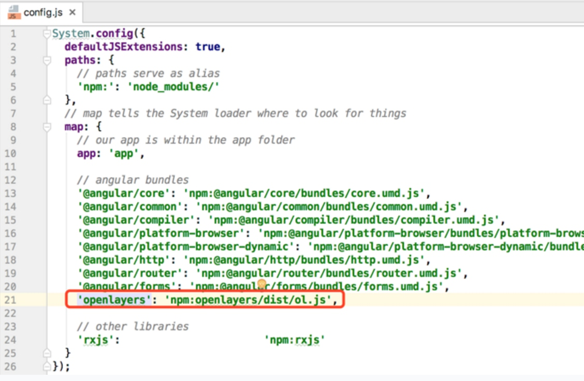
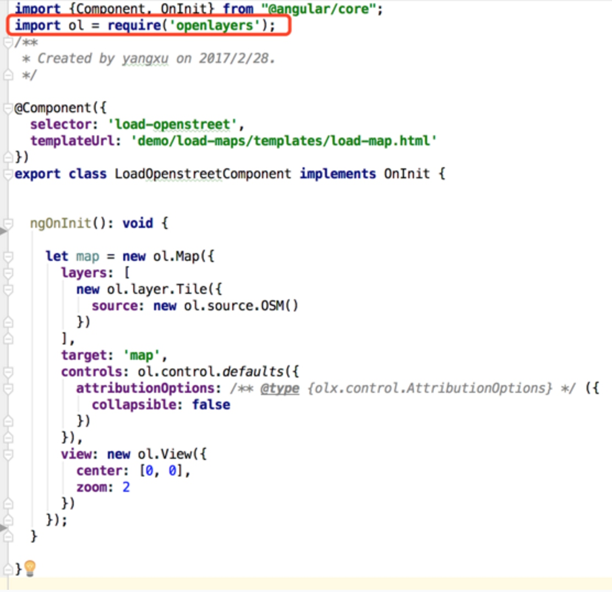
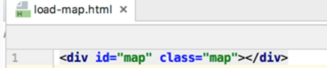
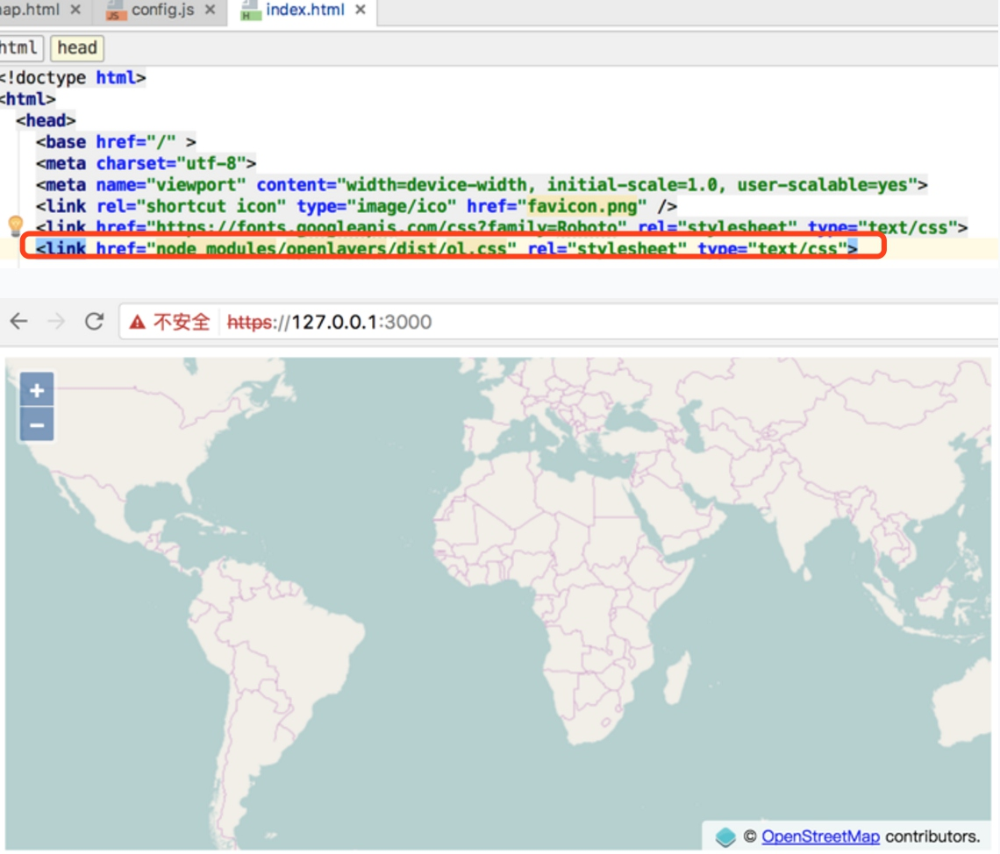

title: 0. install & 加载openstreet地图
date:2017-03-01 19:47:55

# 1. 创建git项目后，使用ng-fullstack脚手架初始化项目，加载默认的主页

# 2. 执行npm命令安装openlayer v4包

```powershell
$ npm install openlayers --save
```

# 3. 安装typescript针对openlayers的类型声明，避免编译失败

```powershell
$ npm install @types/openlayers --save-dev
```

# 4. 修改SystemJS的配置文件，定义openlayers需要加载的js文件



# 5. 定义Component，使用官方demo中的地图加载代码，加载openstreet地图








# 6. 在类型描述文件中，使用了`export =`语法，所以在引入的时候需要使用require


# 7. 刷新页面后，地图成功加载，但是发现openlayers默认的样式文件ol.css还没有载入

## 8. 主页面加入ol.css的引用


